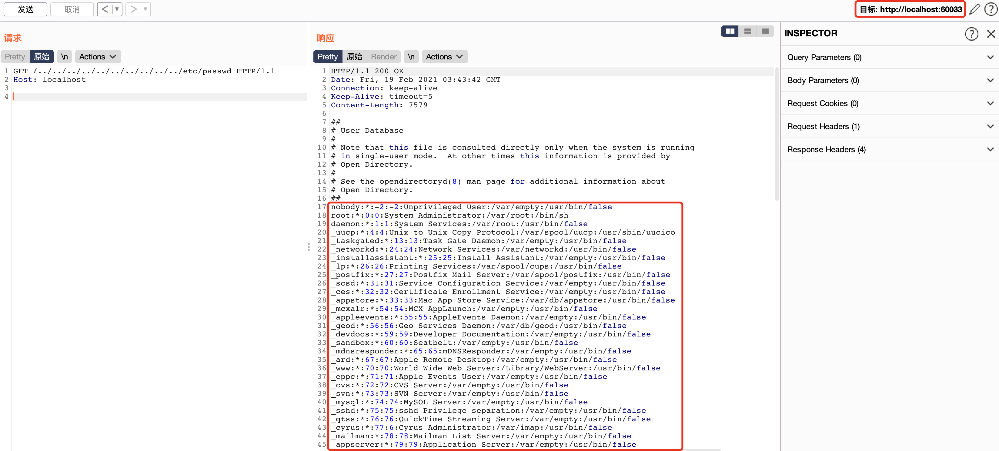

### html5-to-pdf node module has arbitrary file reading vulnerability in req.url parameter of /lib/server.js 

First, copy the project from the address in https://github.com/peterdemartini/html5-to-pdf and enter the root path of the project and use `npm install` command to install dependency of the project. 

Then, you can use the example.js file in the example directory to start the project, and the corresponding command is `node example.js`.

The project will start a file server, and you can print the port that the server listens to in the address function of the server.js file.

Finally, the sensitive file /etc/passwd can be obtained by constantly jumping to the higher-level directory in the url path because the application does not make any restrictions on the input path.

